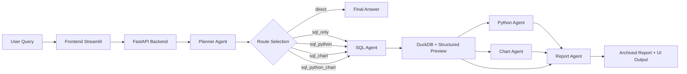

# AI Data Copilot

AI Data Copilot is a multi-agent data analysis application built with `FastAPI + Streamlit + LangGraph + DuckDB`.

It turns natural language requests into:
- structured workflow planning
- SQL generation and execution
- Python-based analysis
- chart generation
- business-facing final reports

This project is designed as a portfolio-ready AI agent system that demonstrates:
- workflow-driven agent orchestration
- tool-using LLM applications
- persona-based agent behavior
- full-stack delivery from backend to frontend UI

## Highlights

- **Multi-agent workflow**: Planner, SQL, Python, Chart, and Report agents collaborate through LangGraph.
- **Persona system**: Supports five specialized personas with different routing preferences and output styles.
- **Structured execution**: SQL results are exposed as preview tables, downloadable CSV, and reusable analysis context.
- **Interactive UI**: Streamlit workspace supports session memory, report archive, chart download, and persona-guided example prompts.
- **Safe-by-default tools**: SQL is read-only, Python/chart execution is restricted, and failures are surfaced as human-readable warnings.
- **GitHub-friendly architecture**: Clean project structure, `.env.example`, and no local runtime artifacts committed.

## Demo Scenarios

This project is suitable for demonstrating the following AI application scenarios:
- Natural language to SQL analytics
- Multi-step data reasoning with Python
- Automated chart generation
- Management-ready report generation
- Persona-driven AI assistants for different business roles

## Agent Personas

The current version includes five specialized personas:

| Persona | Focus | Preferred Behavior |
| --- | --- | --- |
| `数据分析师` | General business analysis | Balanced workflow, metric decomposition, anomaly explanation |
| `SQL 专家` | Complex SQL generation | SQL-first, correctness and query structure |
| `Python 分析师` | Deeper statistical analysis | Stronger use of Python and analytical reasoning |
| `图表可视化专家` | Visualization and storytelling | Favors chart routes and presentation-friendly visuals |
| `决策汇报专家` | Executive communication | Concise, top-down summaries and action recommendations |

## System Architecture

The project follows a layered architecture:

1. **Presentation Layer**: Streamlit UI in `frontend/`
2. **API Layer**: FastAPI service in `backend/`
3. **Workflow Layer**: LangGraph orchestration in `core/workflow/`
4. **Agent Layer**: Planner, SQL, Python, Chart, Report personas in `core/agents/`
5. **Tool Layer**: SQL execution, Python runtime, chart generation in `core/tools/`
6. **Storage Layer**: SQLite session/report state and DuckDB analytics data

## Architecture Diagram



## End-to-End Flow

1. User submits a question in the Streamlit workspace.
2. Planner decides the minimum route: `direct`, `sql_only`, `sql_python`, `sql_chart`, or `sql_python_chart`.
3. SQL Agent retrieves data from DuckDB.
4. Python Agent and Chart Agent run only when needed.
5. Report Agent produces a business-readable final answer.
6. The system stores session history, execution context, and report artifacts.

## Project Structure

```text
AI+Data/
├─ backend/            # FastAPI API service
├─ config/             # Settings, prompts, persona registry
├─ core/
│  ├─ agents/          # Agent node implementations
│  ├─ data_connectors/ # DuckDB connector
│  ├─ tools/           # SQL / Python / chart tools
│  └─ workflow/        # LangGraph state and graph
├─ frontend/           # Streamlit application
├─ infrastructure/     # Reserved infrastructure abstractions
├─ plugins/            # Reserved plugin extension points
├─ storage/            # SQLite persistence logic
├─ .env.example
├─ .gitignore
├─ README.md
└─ requirements.txt
```

## Tech Stack

- `FastAPI`
- `Streamlit`
- `LangGraph`
- `LangChain / OpenAI`
- `DuckDB`
- `SQLite`
- `Pandas`
- `Matplotlib / Seaborn`

## Quick Start

### 1. Install Dependencies

```bash
pip install -r requirements.txt
```

### 2. Configure Environment

Copy `.env.example` to `.env` and fill in your `OPENAI_API_KEY`.

```bash
cp .env.example .env
```

On Windows PowerShell, you can also do:

```powershell
Copy-Item .env.example .env
```

### 3. Start Backend

```bash
python -m uvicorn backend.main:app --reload --port 8000
```

### 4. Start Frontend

```bash
streamlit run frontend/app.py
```

## Recommended Demo Questions

Use these prompts when showcasing the project:

- `请分析 sales 表的销售趋势，并总结变化原因`
- `为 sales 表生成适合周会汇报的图表`
- `帮我生成一个带窗口函数的销售排名 SQL`
- `基于 sales 表给我一份管理层可读的经营汇报`
- `分析产品销售之间是否存在相关性，并给出解释`

## UI Screenshots

You can add screenshots here before publishing the repository publicly.

Recommended screenshots:
- Homepage / workspace overview
- Persona selection panel
- SQL preview table
- Chart generation result
- Final report tab

Example markdown after you capture images:

```md


```

## Why This Project Is Portfolio-Worthy

- It is not just a single LLM wrapper, but a complete multi-agent application.
- It demonstrates real orchestration, state management, tool usage, and frontend/backend integration.
- It shows practical product thinking: personas, report archive, execution logs, download flows, and UI polish.
- It is easy to explain in interviews because the workflow and architecture are clear.

## Current Scope

This repository is optimized for local demonstration and portfolio presentation.

For easier setup:
- `PostgreSQL / Redis / vector DB` heavy deployment was simplified
- `DuckDB + SQLite` are used as lightweight local runtime components
- the architecture still preserves clear extension points for future enterprise upgrades

## Future Directions

- More domain personas such as finance, operations, sales, and risk control
- Better report templates per persona
- Stronger execution sandboxing
- More polished chart layouts and dashboard outputs
- Multi-source connectors beyond DuckDB

## License

This project currently does not include an explicit open-source license.
If you plan to publish it publicly on GitHub, consider adding a license such as `MIT`.
